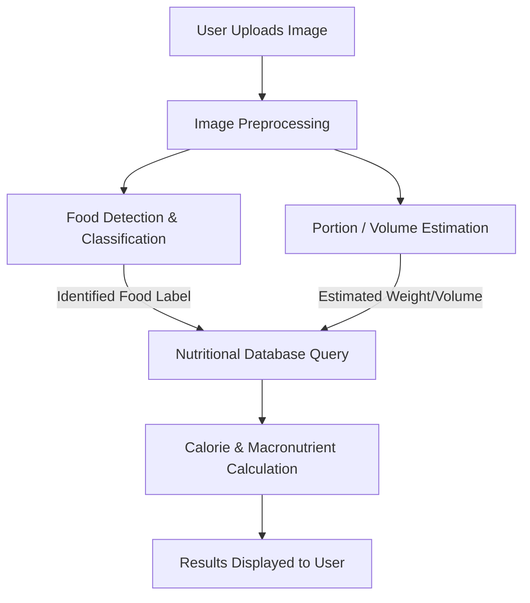

# Image-Based Food Calorie Estimator Project: Comprehensive Implementation Guide

This guide provides a step-by-step blueprint for building an **Image-Based Food Calorie Estimator**. This project is a multi-disciplinary Computer Vision and Machine Learning task that combines food item identification, portion/volume estimation, and nutritional database lookups to calculate calories from a single image.

---

## 📌 Project Architecture



---

## 📊 Dataset Links & Resources

To build a reliable estimator, you need training data. Here are the primary datasets and API resources for this project:

### 1. Image-to-Nutrient Benchmarks (Primary Datasets)

- **[Nutrition5k Dataset](https://github.com/google-research-datasets/Nutrition5k)** (Highly Recommended)
   - **Description:** Over 5,000 dishes of real-world food with side-angle video, overhead RGB-D (color + depth) images, ingredient lists, per-ingredient mass, and total calories/macros.
   - **Use Case:** Training end-to-end models to estimate caloric value directly from visual inputs.
   - **💡 How to use without downloading all 181 GB:**
      - **Approach A (Metadata-Only):** Download only the CSV metadata files (under 5 MB total). You can use a pre-trained general object detector (like YOLOv8) to classify ingredients, then use the Nutrition5k metadata to retrieve calorie/macro densities.
      - **Approach B (Mini-Subset):** Download the CSV metadata files first, then use a custom Python script to download only a small subset of images (e.g., the first 500 images) directly from the public Google Cloud Storage bucket (`gs://nutrition5k_dataset/nutrition5k_dataset/imagery/`).
      - **Approach C (Cloud Execution):** Run your project in **Google Colab** or **Kaggle Notebooks**. Since they are hosted in the cloud, you can copy files directly from Google Cloud Storage to the cloud VM's local storage in seconds, bypassing your local internet and hardware limits.
- **[Food Portion Benchmark (FPB)](https://huggingface.co/datasets/issai/Food_Portion_Benchmark)**
   - **Description:** 14,083 images with bounding boxes and laboratory-measured weights for 138 food classes.
   - **Use Case:** Training models to predict portion sizes/weights.
- **[Food-101 Dataset](https://www.kaggle.com/datasets/dansbecker/food-101)**
   - **Description:** 101,000 images of 101 food categories.
   - **Use Case:** Training the base image classifier to recognize food types.

### 2. Nutritional Databases & APIs (Mapping Food to Calories)

- **[USDA FoodData Central API](https://fdc.nal.usda.gov/)** (Official US Gov Database)
   - **Use Case:** Fetching precise nutrient profiles (calories, protein, fats, carbs per 100g) for recognized food labels.
- **[Kaggle: Calories in Food Items (Per 100 Grams)](https://www.kaggle.com/datasets/koustubhk/calories-in-food-items-per-100-grams)**
   - **Use Case:** Local SQL/CSV database alternative to avoid real-time API calls.

---

## 🛠️ Step-by-Step Implementation Link

Below is the step-by-step roadmap to build this project from scratch:

### Step 1: Project Setup & Environment

Create a clean virtual environment and install the required machine learning, image processing, and web application libraries:

```bash
# Create and activate virtual environment
python -m venv env
.\env\Scripts\activate

# Install core dependencies
pip install torch torchvision opencv-python numpy pandas matplotlib requests streamlit ultralytics
```

#### 📦 Download a Small Subset of Nutrition5k

Since the full dataset is 181 GB, we have included a helper script [download_subset.py](file:///C:/Users/bhaba/.gemini/antigravity-ide/scratch/food-calorie-estimator/download_subset.py) to download all of the metadata files and a tiny subset of overhead images (e.g., 20 images) to get you started immediately without high-bandwidth downloads:

```bash
# Run the downloader helper script
python download_subset.py
```

### Step 2: Food Identification (Object Detection & Classification)

Use a pre-trained model or fine-tune **YOLOv8** / **ResNet50** on the **Food-101** dataset.

```python
import torch
import torchvision.models as models
import torchvision.transforms as transforms
from PIL import Image

class FoodClassifier:
    def __init__(self, num_classes=101):
        # Load a pre-trained ResNet50 model
        self.model = models.resnet50(pretrained=True)
        # Modify the final classification layer for Food-101
        num_ftrs = self.model.fc.in_features
        self.model.fc = torch.nn.Linear(num_ftrs, num_classes)
        self.model.eval()

        # Define image preprocessing steps
        self.transform = transforms.Compose([
            transforms.Resize(256),
            transforms.CenterCrop(224),
            transforms.ToTensor(),
            transforms.Normalize(mean=[0.485, 0.456, 0.406], std=[0.229, 0.224, 0.225]),
        ])

    def predict(self, image_path, class_names):
        image = Image.open(image_path).convert("RGB")
        tensor = self.transform(image).unsqueeze(0)

        with torch.no_grad():
            outputs = self.model(tensor)
            _, preds = torch.max(outputs, 1)

        return class_names[preds[0].item()]
```

### Step 3: Portion/Volume Estimation (The Critical Step)

Calorie calculation requires portion size (grams or volume). Since images are 2D, volume estimation is typically solved using:

1. **Reference Object Scaling:** Using a known physical reference (like a coin, spoon, or the plate itself) in the image to establish a pixel-to-millimeter ratio.
2. **Monocular Depth Estimation:** Utilizing deep learning depth estimators (e.g., MiDaS) to extract a 3D depth map from a single image.

Here is how to extract a depth map for volumetric analysis:

```python
import cv2
import torch

def estimate_depth(image_path):
    # Load MiDaS model for depth estimation
    model_type = "MiDaS_small"  # High speed, moderate accuracy
    midas = torch.hub.load("intel-isl/MiDaS", model_type)

    # Select execution device
    device = torch.device("cuda" if torch.cuda.is_available() else "cpu")
    midas.to(device)
    midas.eval()

    # Load transforms
    midas_transforms = torch.hub.load("intel-isl/MiDaS", "transforms")
    transform = midas_transforms.small_transform if model_type == "MiDaS_small" else midas_transforms.dpt_transform

    # Read image
    img = cv2.imread(image_path)
    img = cv2.cvtColor(img, cv2.COLOR_BGR2RGB)
    input_batch = transform(img).to(device)

    with torch.no_grad():
        prediction = midas(input_batch)
        prediction = torch.nn.functional.interpolate(
            prediction.unsqueeze(1),
            size=img.shape[:2],
            mode="bicubic",
            align_corners=False,
        ).squeeze()

    depth_map = prediction.cpu().numpy()
    return depth_map
```

### Step 4: Caloric Database Integration

Map the identified food items to nutritional databases to convert volume/weight estimations into calorie and macronutrient values.

```python
import requests

def get_nutritional_info(food_name, weight_grams):
    # Example using USDA FoodData Central API
    API_KEY = "DEMO_KEY"  # Register on FDC to get your own key
    url = f"https://api.nal.usda.gov/fdc/v1/foods/search?api_key={API_KEY}&query={food_name}"

    response = requests.get(url).json()
    if not response.get("foods"):
        return None

    # Get the top matching food item
    food = response["foods"][0]
    nutrients = food.get("foodNutrients", [])

    calories_per_100g = 0
    for nutrient in nutrients:
        # Nutrient ID 208 corresponds to energy (kcal)
        if nutrient.get("nutrientId") == 208:
            calories_per_100g = nutrient.get("value", 0)
            break

    # Calculate calories based on estimated weight
    total_calories = (calories_per_100g / 100.0) * weight_grams
    return {
        "food": food_name,
        "weight_g": weight_grams,
        "calories": round(total_calories, 2)
    }
```

### Step 5: User Interface Development (Streamlit)

Construct a clean, responsive frontend for users to upload food images and see immediate calorie estimates.

```python
import streamlit as st
from PIL import Image

st.set_page_config(page_title="AI Calorie Estimator", layout="centered")

st.title("🥗 Image-Based Food Calorie Estimator")
st.write("Upload a photo of your plate to analyze its nutritional value.")

uploaded_file = st.file_uploader("Choose an image...", type=["jpg", "jpeg", "png"])

if uploaded_file is not None:
    image = Image.open(uploaded_file)
    st.image(image, caption="Uploaded Image", use_column_width=True)

    with st.spinner("Analyzing food items..."):
        # Placeholder call to your estimation pipeline
        # estimated_food = classifier.predict(uploaded_file)
        # estimated_weight = estimate_volume_and_weight(uploaded_file)
        # result = get_nutritional_info(estimated_food, estimated_weight)

        # Example UI Output
        st.success("Analysis Complete!")
        col1, col2, col3 = st.columns(3)
        col1.metric("Detected Item", "Pizza Margherita")
        col2.metric("Estimated Weight", "320g")
        col3.metric("Estimated Calories", "824 kcal")
```

---

## 📈 Future Enhancements

1. **3D Reconstruction (NeRF / 3D Gaussian Splatting):** Use multi-angle images or videos to build a 3D model of the food plate for highly accurate volume estimation.
2. **Semantic Segmentation (SAM):** Use Meta's Segment Anything Model (SAM) to isolate multiple food items on a single plate and run calorie estimates individually.
3. **Real-world Calibration:** Implement a custom depth reference marker (such as a standard coin or plate circumference selector) on the mobile application to anchor visual dimensions.
