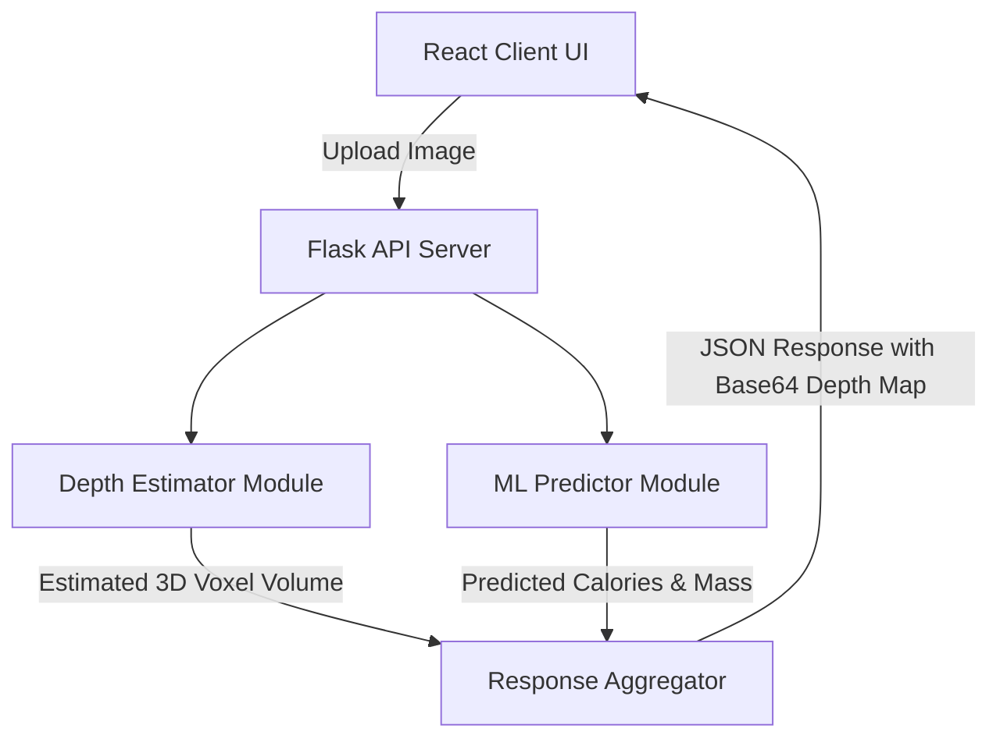

# AuraCal: Image-Based Food Calorie & Nutrient Estimator

[](https://www.python.org/)
[](https://react.dev/)
[](https://flask.palletsprojects.com/)
[](#)

AuraCal is a full-stack, machine-learning-powered application designed to estimate the mass, volume, and caloric value of meals from a single overhead food photograph.

By combining monocular depth estimation (to compute 3D volumetric parameters) with deep learning regression models (to predict density and calories), AuraCal bridges the gap between visual food recognition and precise diet tracking.

---

## Project Architecture



---

## Accurate Directory Layout

This project follows a decoupled client-server architecture:

```text
Image-Based-Calorie-Estimator/
├── backend/                         # Flask API backend & ML scripts
│   ├── app.py                       # Main server entrypoint
│   ├── requirements.txt             # Python packages
│   ├── download_subset.py           # Imagery subset downloader
│   ├── dish_ingredients.csv         # Local Kaggle dataset metadata
│   ├── data/
│   │   └── imagery/                 # Downloaded training images
│   └── src/                         # ML pipeline packages
│       ├── __init__.py
│       ├── config.py                # Hyperparameters & paths
│       ├── dataloader.py            # PyTorch custom dataset loader
│       ├── classification_model.py  # ResNet50 regression network
│       ├── depth_model.py           # MiDaS wrapper class
│       ├── train.py                 # Training script
│       ├── inference.py             # Inference predictor wrapper
│       └── utils.py                 # Volume math & helpers
└── frontend/
    └── Food-Calorie-Estimator/      # Vite/React frontend project
        ├── package.json             # NPM configuration
        ├── vite.config.js           # Vite server configuration (CORS proxy)
        ├── index.html               # Main entry HTML
        ├── eslint.config.js         # Lint rules
        └── src/
            ├── main.jsx             # React launcher script
            ├── App.jsx              # App layout & API fetching
            ├── App.css              # Cyberpunk Neo-Brutalist stylesheet
            └── index.css            # Global CSS resets
```

---

## Step-by-Step Execution Guide

### **1. Setup the Python Backend**

Navigate into the `backend/` directory, configure your virtual environment, and install dependencies:

```bash
cd backend

# Create virtual environment
python -m venv env

# Activate environment
# On Windows PowerShell:
.\env\Scripts\Activate.ps1
# On Windows CMD:
.\env\Scripts\activate.bat
# On macOS/Linux:
source env/bin/activate

# Install required dependencies
pip install -r requirements.txt
```

### **2. Place your Local CSV & Fetch Images**

Make sure your downloaded `dish_ingredients.csv` file from Kaggle is copied into the `backend/` directory, then run the image subset downloader:

```bash
python download_subset.py
```

- **Purpose:** Reads the CSV to find unique dish IDs, then downloads a light training subset (50 images) directly from Google Cloud Storage to `./data/imagery/`.

### **3. Train the Regression Model**

Execute the training loop to fine-tune the ResNet50 feature extractor:

```bash
python -m src.train
```

- **Purpose:** Learns visual calorie and mass patterns from the imagery subset.
- **Output:** Generates the checkpoint file `backend/models/classification/best_classifier.pth`.

### **4. Start the Flask Server**

```bash
python app.py
```

- **API URL:** Server runs locally on `http://127.0.0.1:5000/`.

---

### **5. Setup the React Frontend**

Open a **new** terminal window and navigate into the React directory:

```bash
cd frontend/Food-Calorie-Estimator

# Install node dependencies
# Run only the first time
npm install

# Start Vite development server
npm run dev
```

- **Interface URL:** Runs locally on `http://localhost:5173`. Open this in your browser to interact with the application.

---

## Technical Details & Models

1. **3D Volumetric Analysis:**
   - **MiDaS Small (`MiDaS_small`):** A lightweight monocular depth estimation network used to map depth pixels from a single color image.
   - **Voxel math:** The background is thresholded out, and the height pixels are summed to estimate relative volume (in cubic centimeters).
2. **Calorie & Mass Regression:**
   - **ResNet-50 backbone:** Uses pre-trained ImageNet weights to extract high-level visual features of the food.
   - **Regression FC Head:** Replaces the standard classification layer with linear maps outputting continuous variables (Estimated Calories and Mass).

---

## Theme & Aesthetics

AuraCal features a **Cyberpunk Neo-Brutalist** dashboard interface designed to be visually impactful:

- **Font Style:** High-contrast `Space Mono` geometric monospace typography.
- **Color Palette:** Neon Lime (`#84cc16`), Cyberpunk Magenta (`#d946ef`), and Saturated Cyan (`#06b6d4`) offsets.
- **Design Tokens:** Thick black borders (`4px solid #000`), sharp `0px` corners, and offset flat box-shadows (`6px 6px 0px #000`) with interactive hover translations.
